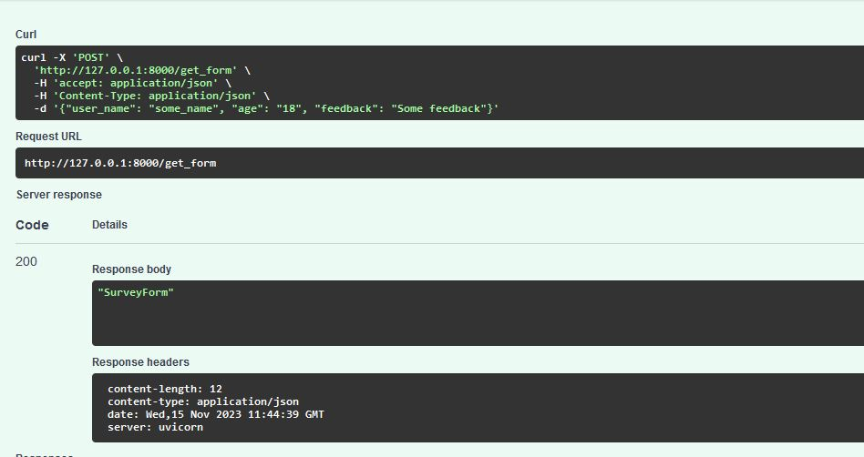
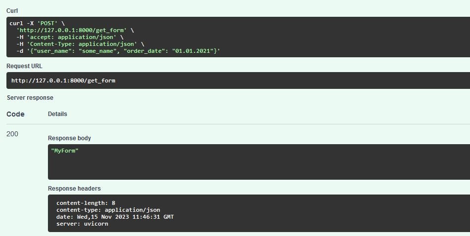
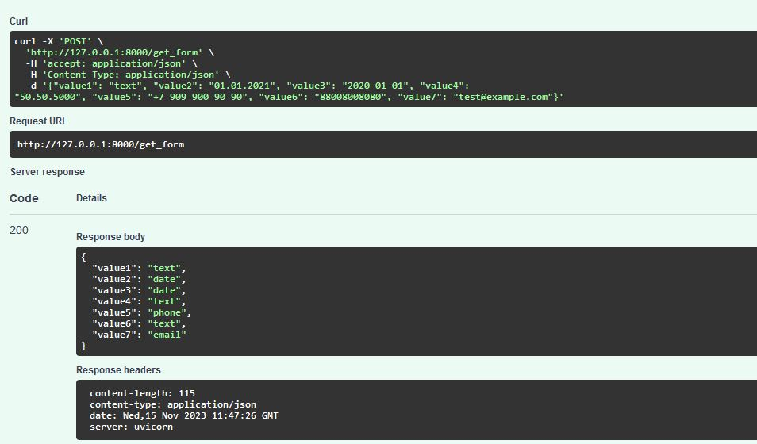

# Web-приложение для определения типа заполненных форм

Позволяет проверить получаемого набора данных на соотвествие его одному из шаблонов форм в БД, 
либо валидировать их и вернуть с типов.

### клонируем репозиторий 

    git clone https://github.com/se-andrey/check_form.git

### запуск

Создайте файл .env и заполните его в соответствии с .env.example.

Если на сервере нет docker/docker-compose, то установите его - инструкция https://docs.docker.com/

Для запуска:

    docker-compose up --build 

Для остановки:

    docker-compose down 

### описание

В БД хранится список шаблонов форм. Каждый шаблон может содержать названия поля и его тип.

Приложение принимает на вход список названий полем и их содержимое. Если это соответсвует шаблону в базе, то возвращает его название. 

Получаемых значений может быть больше, чем в шаблонах. В таком случае возвращается наиболее подходящее имя шаблона.

Если набор значений не соответствует ни одному из шаблонов, то возвращаются названия полей с указанием их типов.

### примеры

